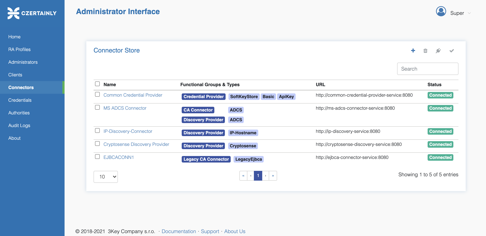

# CZERTAINLY Administrator User Interface

> This repository is part of the commercial open-source project CZERTAINLY, but the UI is available under subscription. You can find more information about the project at [CZERTAINLY](https://github.com/3KeyCompany/CZERTAINLY) repository, including the contribution guide.

Administrator User Interface or commonly called as Admin UI consists of the administrative web interface where various administrative tasks can be performed on top of the platform by the administrators.

Admin UI contains the following menu items:

| Menu item          | Short Description                                                                                                                                                                                                           |
| -------------- | --------------------------------------------------------------------------------------------------------------------------------------------------------------------------------------------------------------------------- |
| Home           | Contains useful links and description of the platform including support contacts                                                                                                                                            |
| RA Profile     | Management of RA Profiles including creating a new profile, enable/disable operations, authorizing a new client, edit and delete a profile                                                                                  |
| Administrators | Provides list of available administrators including the action on each administrator and other related operations                                                                                                           |
| Clients        | List of Clients who are authorized to use the platform and the access to RA Profiles on each client can be controlled from the client pages                                                                                 |
| Connectors     | Provides an overview of available connectors, their details and status. Operations on the connectors like Approvals, Reconnection on each or multiple connectors can be performed on this page                              |
| Credentials    | List of all the credentials added to the platform. These credentials are used only for the connector related operations and do not contain any platform authorization related items                                         |
| Authorities    | List of Certificate Authorities added and the action on each authority. These authorities can be added based on the connectors available in the platform                                                                    |
| Audit Logs     | Audit log records all operations on CZERTAINLY to reconstruct any event in case of investigation. It also proves the compliance with the various standards and regulations, such as PCI DSS, ISO 27k, GDPR, Web Trust, etc. |
| About          | About Certainly, Support Contacts and other relevant information                                                                                                                                                            |

### Details of Objects

The links and pages are constructed in a way to make the navigation between the pages easier. To view the details of any object the user can simply click on the name to be redirected to the detailed view.

### Icons and Tooltip

For the ease of understanding and usage, the Icons are added with tooltip to understand the actions it provides when needed.

### Operations

Bulk operations can be performed on most of the objects from their list page. To perform any operation on a single object (for example - a connector), the user can do it either from the list page or the details page.

For more information, refer to the CZERTAINLY documentation.

> Administrator UI Consists of operation related only to the Management and perform administrative tasks on the platform. This does not provide CLM related operations. For the details of CLM related operations please refer to Operator UI section of the CZERTAINLY documentation.
